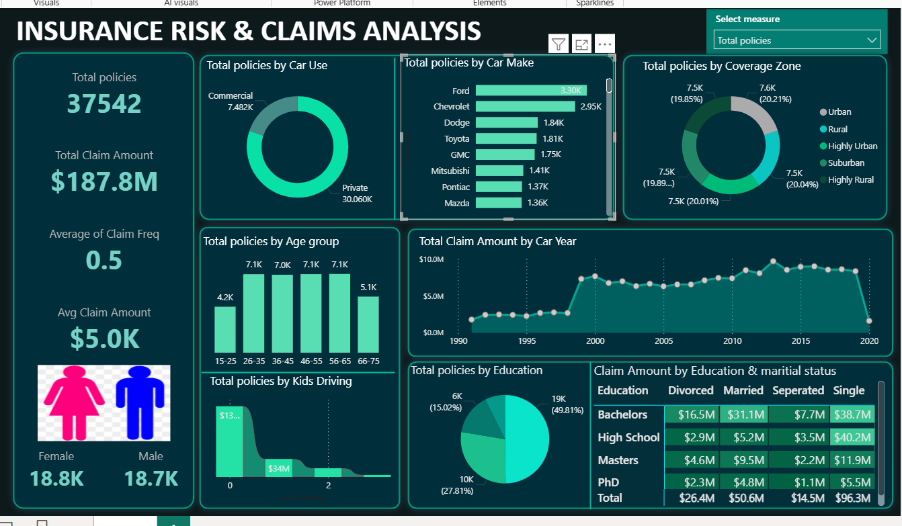

# 📊 Insurance Risk & Claims Analysis – Power BI Dashboard  

## 🏷 Project Title  
**Insurance Risk & Claims Analysis Dashboard**  

---

## 📝 Example  
This project is an end-to-end **business intelligence solution** for analyzing insurance policies and claims.  
Using **Power BI**, I transformed raw insurance data into **interactive dashboards** that help insurance companies identify **risk patterns, claim trends, and customer behavior**.

---

## 🎯 Purpose / Description  
The main purpose of this project is to provide a **data-driven approach** for understanding:  
- Policy distribution across car types, regions, and demographics  
- Claim frequency and claim amount trends  
- Customer segmentation based on age, education, and marital status  
- Risk profiling for better decision-making and fraud detection  

This dashboard allows stakeholders to **make informed business decisions**, **optimize pricing strategies**, and **minimize claim losses**.

---

## 🛠 Tech Stack  
- **Power BI** – Data visualization & interactive dashboard creation  
- **DAX** – Custom KPIs & calculated measures  
- **Excel / CSV** – Sample insurance dataset  
- **Data Modeling** – Relationship building & data cleaning  

---

## 📂 Data Source  
- **Sample Insurance Dataset** (fictional data)  
  - **Policy Details**: Car Make, Car Year, Car Use (Private/Commercial)  
  - **Customer Demographics**: Age, Gender, Education, Marital Status  
  - **Claim Details**: Claim Amount, Claim Frequency  
  - **Coverage Zone**: Urban, Rural, Suburban, Highly Urban, Highly Rural  

---

## 🌟 Features  
✅ **KPI Cards** – Total Policies, Total Claim Amount, Average Claim Frequency & Claim Amount  
✅ **Demographic Insights** – Gender, Age group, Education level segmentation  
✅ **Policy Breakdown** – By Car Use, Car Make, Coverage Zone  
✅ **Claims Analysis** – Claim amount by Car Year, Education & Marital Status  
✅ **Risk Factors** – Impact of Kids Driving on policies & claims  
✅ **Interactive Filters** – Dynamic drilldowns for better insights  

---

## 🔑 Highlights  
- **37,542 Total Policies** analyzed  
- **$187.8M Total Claim Amount** processed  
- Balanced gender distribution (Female: 18.8K | Male: 18.7K)  
- Claim amount trend analysis across **30+ years**  
- Segmentation by **Car Use, Age Group, Education, Coverage Zone**  

---

## 📸 Dashboard Preview  

---

## 🚀 How to Use  
1. Download the `.pbix` file from this repository  
2. Open it in **Power BI Desktop**  
3. Explore the dashboard using filters & slicers  

---

## 📌 Use Case  
This dashboard can be used by **insurance companies**, **risk analysts**, and **data analysts** to:  
- Understand claim patterns & risks  
- Optimize premium pricing strategies  
- Detect high-risk zones, cars, and customer segments  
- Make data-driven decisions to minimize losses  

---

## 🤝 Contributions  
Pull requests are welcome! For major changes, please open an issue first to discuss what you would like to change.

---

## 🧑‍💻 Author  
**Nikita Jadhav**  
📧 jadhavnikita72003@gmail.com 
🔗 https://www.linkedin.com/in/nikita-jadhav-1340002a7
---
